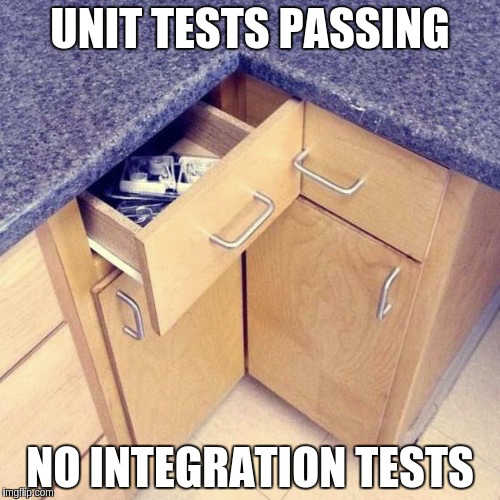

class: center middle

# Testing and Continuous Integration
### Hao-Ting Wang
#### CRIUGM

###### [wanghaoting.com/bids-ecosystem](https://wanghaoting.com/testing-and-ci/)
###### Updated from 2023 Brainhack School Montreal lecture from François Paugam
---
name: footer
layout: true

Testing and CI - Brainhack School Montreal 2025

---

# Outline

1. What is testing?

2. What is Continuous Integration

3. Let's practice both.

---

# What is the purpose of testing?

- Verify our tool doesn't crash

--

- Make sure inputs/outputs are in the expected form

--

- Make sure our tool handles corner-cases

--

- Make sure the outputs are of sufficient "quality"

--

- Evaluate performance

--

- Identify bugs

--

- Test the effectiveness of bug fixes

--

- ...

---

# Types of Testing

.footnote[
Source: https://www.softwaretestinghelp.com/types-of-software-testing/
]

--

.pull-left[
  ## Functional Testing: Does it work?
  - Unit Testing
  - Integration Testing
  - Smoke Testing
  - Regression Testing
]

--

count: false

.pull-right[
  ## Non-Functional Testing: How well does it work?
  - Performance/Load/Stress Testing
  - Volume Testing
  - Compatibility Testing
  - Install Testing
]

---

template: footer
class: center middle

---

template: footer

# What kind of tests should I focus on?

.footnote[
Source: https://www.softwaretestinghelp.com/types-of-software-testing/
]

--

.pull-left[
  ## Functional Testing: Does it work?
  - Unit Testing
  - Integration Testing
  - Smoke Testing
  - Regression Testing
]

.pull-right[
  ## Non-Functional Testing: How well does it work?
  - Performance/Load/Stress Testing
  - Volume Testing
  - Compatibility Testing
  - Install Testing
]

---

count: false

# What kind of tests should I focus on?

.pull-left[
  ## Functional Testing: Does it work?
  - *Unit Testing*
  - *Integration Testing*
  - *_Smoke Testing_*
  - Regression Testing
]

.pull-right[
  ## Non-Functional Testing: How well does it work?
  - *Performance/Load/Stress Testing*
  - Volume Testing
  - Compatibility Testing
  - *_Install Testing_*
]

.footnote[
Source: https://www.softwaretestinghelp.com/types-of-software-testing/
]

---

# How do we store our tests?

- Module and functions
- External scripts
- Example workflows
- Executable documentation
- Evaluate performance (speed, memory)

## Should we test our tests ?

---
template: footer
class: center middle

## If we are supposed to do this every time we change something...
## ... when would we have time to do anything else 😱?!

---

template: footer
class: center middle

# Break (?)

---

template: footer
class: center middle

# Continuous integration

---

template: footer

# We want to

- Write the basic scaffolding of our project

--

- Set it up to install and run using CI

--

  - if we went so far as to write the tests first, this would be called "test driven development"

--

- Add tests alongside new features

--

- Let CI spend time running the tests while we go drink coffee

---

# Tools used in the hands on

## Pytest for writing and running tests
## Github actions for the continuous integration

[Repo](https://github.com/FrancoisPgm/testing_CI_module)

---

class: center middle

# Questions?

###### [wanghaoting.com/testing_n_ci](https://wanghaoting.com/testing-and-ci/)
