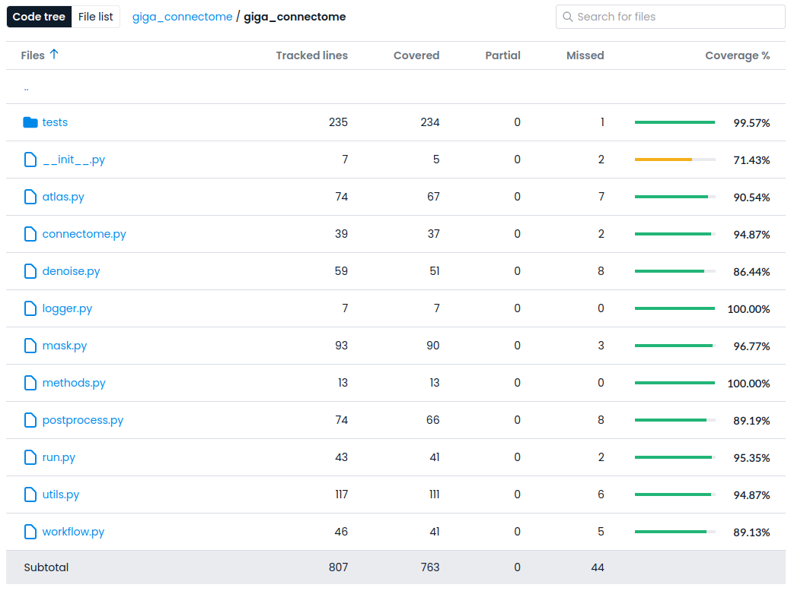
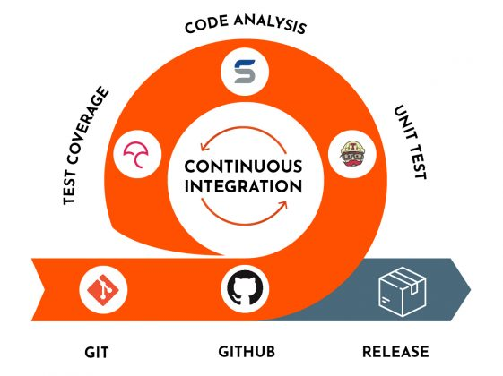

class: center, middle

# Testing and Continuous Integration
### Hao-Ting Wang
#### CRIUGM

###### [wanghaoting.com/testing-and-ci](https://wanghaoting.com/testing-and-ci/)
###### Updated from 2023 Brainhack School Montreal lecture from François Paugam
---
name: footer
layout: true

.footer[Testing and CI - Brainhack School Montreal 2025]

---

.left-column[
# Outline
]
--
count:false

.right-column[
1. What is Testing?

2. Pytest

3. What is Continuous Integration

4. Github Action

]

---
count:false

.left-column[
# Outline
]

.right-column[
1. What is Testing?

2. Pytest

3. What is Continuous Integration

4. Github Action

If you just want to complete the module exercise, you can skip all the bonus content.
Bonus contents will require knowledge in software packaging.
]

---

layout:true
template: footer
# What is Testing?

---

.left-column[
## The purpose of testing?
]

---
count:false

.left-column[
## The purpose of testing?
]

.right-column[
- Verify our tool doesn't crash
- Make sure inputs/outputs are in the expected form
- Make sure our tool handles corner-cases
- Make sure the outputs are of sufficient "quality"
- Evaluate performance
- Identify bugs
- Test the effectiveness of bug fixes
- ...
]


---

.left-column[
## The purpose of testing?
## Types of Testing
]


--
count: false

.right-column[
.footnote[
Source: https://www.softwaretestinghelp.com/types-of-software-testing/
]
### Functional Testing: Does it work?
- Unit Testing
- Integration Testing
- Smoke Testing
- Regression Testing
]

---

count: false

.left-column[
## The purpose of testing?
## Types of Testing
]

.right-column[
.footnote[
Source: https://www.softwaretestinghelp.com/types-of-software-testing/
]

### Functional Testing: Does it work?
- Unit Testing
- Integration Testing
- Smoke Testing
- Regression Testing

### Non-Functional Testing: How well does it work?
- Performance/Load/Stress Testing
- Volume Testing
- Compatibility Testing
- Install Testing
]

---

.left-column[
## The purpose of testing?
## Types of Testing
]
.right-column[

.center[.contain-image[]]

]

---

.left-column[
## The purpose of testing?
## Types of Testing
## What kind of tests should I focus on?
]

--
count: false

.right-column[
.footnote[
Source: https://www.softwaretestinghelp.com/types-of-software-testing/
]
### Functional Testing: Does it work?
- Unit Testing
- Integration Testing
- Smoke Testing
- Regression Testing

### Non-Functional Testing: How well does it work?
- Performance/Load/Stress Testing
- Volume Testing
- Compatibility Testing
- Install Testing
]

---

count: false

.left-column[
## The purpose of testing?
## Types of Testing
## What kind of tests should I focus on?
]

.right-column[
.footnote[
Source: https://www.softwaretestinghelp.com/types-of-software-testing/
]
### Functional Testing: Does it work?
- *Unit Testing*
- *Integration Testing*
- *_Smoke Testing_*
- Regression Testing

### Non-Functional Testing: How well does it work?
- *Performance/Load/Stress Testing*
- Volume Testing
- Compatibility Testing
- *_Install Testing_*
]


---

.left-column[
## The purpose of testing?
## Types of Testing
## What kind of tests should I focus on?
## How do we store our tests?
]

--
count: false

.right-column[
- Module and functions
- External scripts
- Example workflows
- Executable documentation
- Evaluate performance (speed, memory)
]

---

template: footer
layout:true

---
# Testing in Python with Pytest


.footnote[
    Pytest: https://docs.pytest.org/en/stable/
]

.pull-left[

First you need to install `pytest`:

```bash
pip install pytest
```

A minimal example:

```python
# content of test_sample.py
def inc(x):
    return x + 1


def test_answer():
    assert inc(3) == 5

```

Run it:

```bash
pytest test_sample.py
```
]

--

.pull-right[

In a package (Bonus)

- Usually, we store our test in a directory called `tests`
    
- The test files will be named after the module name, prefix with `test_`, such as `tests/test_mymodule.py`

- Then you can configure `pyproject.toml` to specify where the tests are:

    ```toml
    [tool.pytest.ini_options]
    testpaths = ["tests/"]
    ```
- You can then run `pytest` at the root of the package to trigger the tests.
- Otherwise you have to specify the path:
    ```bash
    pytest tests/test_mymodule.py
    ```
]

---

# Example of test from giga connectome 0.6.0

Let's look at the original function in `giga_connectome/mask.py`
.footnote2[
    https://github.com/bids-apps/giga_connectome/blob/main/giga_connectome/mask.py
]
--

```python
def _check_mask_affine(
    mask_imgs: Sequence[Path | str | Nifti1Image],
) -> list[int] | None:
    """Given a list of input mask images, show the most common affine matrix
    and subjects with different values.

    Parameters
    ----------
    mask_imgs : :obj:`list` of Niimg-like objects
        See :ref:`extracting_data`.
        3D or 4D EPI image with same affine.

    Returns
    -------

    list or None
        Index of masks with odd affine matrix. Return None when all masks have
        the same affine matrix.
    """
```

---

# Example of test from giga connectome 0.6.0

Test in: `giga_connectome/tests/test_mask.py`:

.footnote2[https://github.com/bids-apps/giga_connectome/blob/main/giga_connectome/tests/test_mask.py]

--

```python
def test_check_mask_affine():
    """Check odd affine detection."""

    img_base = np.zeros([5, 5, 6])
    processed_vol = img_base.copy()
    processed_vol[2:4, 2:4, 2:4] += 1
    processed = Nifti1Image(processed_vol, np.eye(4))
    weird = Nifti1Image(processed_vol, np.eye(4) * np.array([1, 1, 1.5, 1]).T)
    weird2 = Nifti1Image(processed_vol, np.eye(4) * np.array([1, 1, 1.6, 1]).T)
    exclude = mask._check_mask_affine(
        [processed, processed, processed, processed, weird, weird, weird2]
    )
    assert len(exclude) == 3
    assert exclude == [4, 5, 6]
```

--

You can run this very specific test like this:
```bash
pytest giga_connectome/tests/test_mask.py::test_check_mask_affine
```

---

# Including tests in a pyhton script

.footnote2[https://gist.github.com/htwangtw/93b725f187110c1f586fd12f59a863c9]

--
count: false


A basic python script:
```python
# import some library

# main function that has all the workflows
def main(): 
    ...

if __name__ == "__main__":
    main()

```
---
count: false

# Including tests in a pyhton script

.footnote2[https://gist.github.com/htwangtw/93b725f187110c1f586fd12f59a863c9]

--
count: false

```python
import re
# skip some library import

niak_pattern = r"fmri_sub(?P<sub>[A-Za-z0-9]*)_sess(?P<ses>[A-Za-z0-9]*)_task(?P<task>[A-Za-z0-9]{,4})(run(?P<run>[0-9]{2}))?"

# Skipping a bunch of preprocessing stuff
def niak2bids(niak_filename):  # We want to test this function
    """Parse niak file name to BIDS entities."""
    print(niak_filename)
    compile_name = re.compile(niak_pattern)
    return compile_name.search(niak_filename).groupdict()

# main function that has all the workflows
def main(): 
    ...

# run script:
# python extract_timeseries.py
if __name__ == "__main__":
    main()
```

---
count: false

# Including tests in a pyhton script

.footnote2[https://gist.github.com/htwangtw/93b725f187110c1f586fd12f59a863c9]

```python
# run script:
# python extract_timeseries.py
if __name__ == "__main__":
    main()

# run tests:
# pytest extract_timeseries.py
def test_niak2bids():
    """Check niak name parser."""
    case_1 = "fmri_sub130S5006_sess20121114_taskrestrun01_n.nii.gz"
    case_2 = "fmri_sub130S5006_sess20121114_taskrest_n.nii.gz"
    assert niak2bids(case_1).get("run", False) == "01"
    assert niak2bids(case_2).get("run", False) == False
```

---

.left-column[
## Bonus: Test coverage

Test coverage describe the degree to which a code base has been tested by a test suite
]
.right-column[
.center[.contain-image[]]
.footnote2[https://app.codecov.io/gh/bids-apps/giga_connectome/tree/main/giga_connectome?displayType=tree]
]

---

.left-column[
## Bonus: Test coverage

## Coverage in PyTest
]

--

.right-column[
.footnote2[https://github.com/pytest-dev/pytest-cov]

Installation

```bash
pip install pytest-cov
```

Usage:

```bash
pytest --cov=myproj tests/
```
]
---
count: false

.left-column[
## Bonus: Test coverage

## Coverage in PyTest
]

.right-column[
.footnote2[https://github.com/pytest-dev/pytest-cov]

Installation

```bash
pip install pytest-cov
```

Usage:

```bash
pytest --cov=myproj tests/
```
Would produce a report like:

```bash
-------------------- coverage: ... ---------------------
Name                 Stmts   Miss  Cover
----------------------------------------
myproj/__init__          2      0   100%
myproj/myproj          257     13    94%
myproj/feature4286      94      7    92%
----------------------------------------
TOTAL  
```
]

---

# Principles of testing

- Test locally first

- Test frequently

- Write small tests

- Use test to examine the complexity of the function


---
template: footer
class: center, middle

## If we are supposed to do this every time we change something...
## ... when would we have time to do anything else 😱?!

---

# Continuous integration

.center[.contain-image[]]

---
template: footer

# We want to

- Write the basic scaffolding of our project

--
count: false

- Set it up to install and run using CI
  - if we went so far as to write the tests first, this would be called "test driven development"

--
count: false

- Add tests alongside new features

--
count: false

- Let CI spend time running the tests while we go drink coffee
---

# GitHub Action: minial example for scripts

```ymal
on: [push]

jobs:
  build:
    runs-on: ubuntu-latest
    strategy:
      matrix:
        python-version: ["3.11"]

    steps:
      - uses: actions/checkout@v3
      - name: Set up Python ${{ matrix.python-version }}
        uses: actions/setup-python@v4
        with:
          python-version: ${{ matrix.python-version }}
      - name: Install dependencies
        run: |
          pip install -r requirements.txt
          pip install pytest
      - name: Test with pytest
        pytest
```

---

# GitHub Action: minial example for packages

```ymal
on: [push]

jobs:
  build:
    runs-on: ubuntu-latest
    strategy:
      matrix:
        python-version: ["3.11"]

    steps:
      - uses: actions/checkout@v3
      - name: Set up Python ${{ matrix.python-version }}
        uses: actions/setup-python@v4
        with:
          python-version: ${{ matrix.python-version }}
      - name: Install dependencies
        run: |
          python -m pip install --upgrade pip
          # Assuming your pyproject.toml has all the dependency info
          pip install . 
          pip install pytest pytest-cov
      - name: Test with pytest and generate coverage
        pytest --cov=mypackage --cov-report=xml --pyargs mypackage
```

---

# Good practices for pain free integration
.pull-right[
.footnote[Source: https://docs.pytest.org/en/7.1.x/explanation/goodpractices.html]
]
--
count:false
- Use virtual environments

--
count:false

## Bonus: for packages

--
count:false

- Define your dependencies in `pyproject.toml` and use `pip` for installing: `pip install -e .[dev]`

--
count:false
- Name your test files with prefix `test_` to allow automatic discovery

---
count:false

# Good practices for pain free integration
- Use virtual environments

## Bonus: for packages

- Define your dependencies in `pyproject.toml` and use `pip` for installing: `pip install -e .[dev]`

- Name your test files with prefix `test_` to allow automatic discovery

- Structure your project to allow easy discovery by `pytest`\*:

.pull-right[
.footnote[Source: https://docs.pytest.org/en/7.1.x/explanation/goodpractices.html]

.footnote2[\*This is not the only type of structure, see this [blog post](https://blog.ionelmc.ro/2014/05/25/python-packaging/#the-structure%3E).]

]

---
count:false

# Good practices for pain free integration
- Use virtual environments

## Bonus: for packages

- Define your dependencies in `pyproject.toml` and use `pip` for installing: `pip install -e .[dev]`

- Name your test files with prefix `test_` to allow automatic discovery

- Structure your project to allow easy discovery by `pytest`\*:

.pull-left[
```bash
pyproject.toml
[src/]mypkg/
    __init__.py
    app.py
    view.py
    test/
        __init__.py
        test_app.py
        test_view.py
        ...
```
]

.pull-right[
.footnote[Source: https://docs.pytest.org/en/7.1.x/explanation/goodpractices.html]

.footnote2[\*This is not the only type of structure, see this [blog post](https://blog.ionelmc.ro/2014/05/25/python-packaging/#the-structure%3E).]

]
---
count:false

# Good practices for pain free integration
- Use virtual environments

## Bonus: for packages
- Define your dependencies in `pyproject.toml` and use `pip` for installing: `pip install -e .[dev]`

- Name your test files with prefix `test_` to allow automatic discovery

- Structure your project to allow easy discovery by `pytest`\*:

.pull-left[
```bash
pyproject.toml
[src/]mypkg/
    __init__.py
    app.py
    view.py
    test/
        __init__.py
        test_app.py
        test_view.py
        ...
```
]

.pull-right[

Run:
```bash
pytest --pyargs mypkg
```
.footnote[Source: https://docs.pytest.org/en/7.1.x/explanation/goodpractices.html]

.footnote2[\*This is not the only type of structure, see this [blog post](https://blog.ionelmc.ro/2014/05/25/python-packaging/#the-structure%3E).]

]

---

# Other practices you might want to consider in the integration check

--
count:false 

.pull-left[
`pre-commit`: Various style/type check for code.

- Associated file: `.pre-commit-config.yaml` and options in `pyproject.toml`

- Trim white space

- Check style and file format (various hooks implemented for basic file types) 

- Spell checker `codespell`

- Automatic formating `black`

- Code style check `flake8`

- Type check (if you are doing it) `mypy`
]

--
count:false

.pull-right[
### You can also...

- Build/upload Docker container

- Download data (for testing)

- Build a PDF paper

- Send notification and messages

- [Put a like button on your README](https://github.com/ariary/Readme-Like-Button)
]

---

# Resources

- [Type of software testing](https://www.softwaretestinghelp.com/types-of-software-testing/)
- [Jeanette’s starter kit for packaging](https://github.com/jmumford/packaging-notes)
- [Good practice for integration](https://docs.pytest.org/en/7.1.x/explanation/goodpractices.html)
- [Packaging a python library](https://blog.ionelmc.ro/2014/05/25/python-packaging/#the-structure%3E): This blog post specificly focused on different structure and impact on testing.
- [Example of including tests in a script](https://gist.github.com/htwangtw/93b725f187110c1f586fd12f59a863c9)

---

# Hands on: create unit tests, integration test, and CI

https://github.com/school-brainhack/testing_CI_module

---

class: center, middle

# Questions?

###### [wanghaoting.com/testing-and-ci](https://wanghaoting.com/testing-and-ci/)
