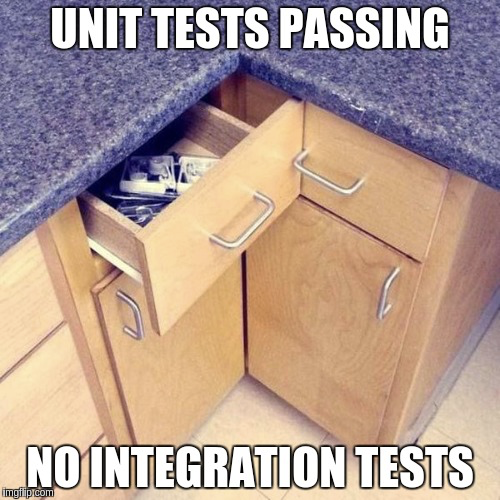

class: center, middle

# Testing and Continuous Integration
### Hao-Ting Wang
#### CRIUGM

###### [wanghaoting.com/testing-and-ci](https://wanghaoting.com/testing-and-ci/)
###### Updated from 2023 Brainhack School Montreal lecture from François Paugam
---
name: footer
layout: true

.footer[Testing and CI - Brainhack School Montreal 2025]

---

# Outline

1. What is Testing?

2. What is Continuous Integration

3. Let's look at an example.

---

# What is the purpose of testing?

- Verify our tool doesn't crash

--
count: false

- Make sure inputs/outputs are in the expected form

--
count: false

- Make sure our tool handles corner-cases

--
count: false

- Make sure the outputs are of sufficient "quality"

--
count: false

- Evaluate performance

--
count: false

- Identify bugs

--
count: false

- Test the effectiveness of bug fixes

--
count: false

- ...

---

# Types of Testing

.footnote[
Source: https://www.softwaretestinghelp.com/types-of-software-testing/
]

--
count: false

.pull-left[
  ## Functional Testing: Does it work?
  - Unit Testing
  - Integration Testing
  - Smoke Testing
  - Regression Testing
]

--

count: false

.pull-right[
  ## Non-Functional Testing: How well does it work?
  - Performance/Load/Stress Testing
  - Volume Testing
  - Compatibility Testing
  - Install Testing
]


---

class: center, middle

.center[.contain-image[]]

---

template: footer

# What kind of tests should I focus on?

.footnote[
Source: https://www.softwaretestinghelp.com/types-of-software-testing/
]

--

.pull-left[
  ## Functional Testing: Does it work?
  - Unit Testing
  - Integration Testing
  - Smoke Testing
  - Regression Testing
]

.pull-right[
  ## Non-Functional Testing: How well does it work?
  - Performance/Load/Stress Testing
  - Volume Testing
  - Compatibility Testing
  - Install Testing
]


---

count: false

# What kind of tests should I focus on?

.pull-left[
  ## Functional Testing: Does it work?
  - *Unit Testing*
  - *Integration Testing*
  - *_Smoke Testing_*
  - Regression Testing
]

.pull-right[
  ## Non-Functional Testing: How well does it work?
  - *Performance/Load/Stress Testing*
  - Volume Testing
  - Compatibility Testing
  - *_Install Testing_*
]

.footnote[
Source: https://www.softwaretestinghelp.com/types-of-software-testing/
]

---

# Example of unit test from giga connectome 0.6.0

Let's look at the original function in `giga_connectome/mask.py`

--

```python
def _check_mask_affine(
    mask_imgs: Sequence[Path | str | Nifti1Image],
) -> list[int] | None:
    """Given a list of input mask images, show the most common affine matrix
    and subjects with different values.

    Parameters
    ----------
    mask_imgs : :obj:`list` of Niimg-like objects
        See :ref:`extracting_data`.
        3D or 4D EPI image with same affine.

    Returns
    -------

    list or None
        Index of masks with odd affine matrix. Return None when all masks have
        the same affine matrix.
    """
```

---

# Example of unit test from giga connectome 0.6.0

What do you expect this test to do?

Test in: `giga_connectome/tests/test_mask.py`:

--

```python
def test_check_mask_affine():
    """Check odd affine detection."""

    img_base = np.zeros([5, 5, 6])
    processed_vol = img_base.copy()
    processed_vol[2:4, 2:4, 2:4] += 1
    processed = Nifti1Image(processed_vol, np.eye(4))
    weird = Nifti1Image(processed_vol, np.eye(4) * np.array([1, 1, 1.5, 1]).T)
    weird2 = Nifti1Image(processed_vol, np.eye(4) * np.array([1, 1, 1.6, 1]).T)
    exclude = mask._check_mask_affine(
        [processed, processed, processed, processed, weird, weird, weird2]
    )
    assert len(exclude) == 3
    assert exclude == [4, 5, 6]
```

---

# How do we store our tests?

- Module and functions
- External scripts
- Example workflows
- Executable documentation
- Evaluate performance (speed, memory)

.center[## Should we test our tests ?]

---
template: footer
class: center, middle

## If we are supposed to do this every time we change something...
## ... when would we have time to do anything else 😱?!

---

# Continuous integration

.center[.contain-image[]]

---
template: footer

# We want to

- Write the basic scaffolding of our project

--

- Set it up to install and run using CI

--

  - if we went so far as to write the tests first, this would be called "test driven development"

--

- Add tests alongside new features

--

- Let CI spend time running the tests while we go drink coffee

---

# Continuous integration for scientific analysis - 

---

# Tools used in the hands on

- **Pytest** for writing and running tests
- **Github actions** for the continuous integration

[Repo](https://github.com/FrancoisPgm/testing_CI_module)

---

class: center, middle

# Questions?

###### [wanghaoting.com/testing-and-ci](https://wanghaoting.com/testing-and-ci/)
